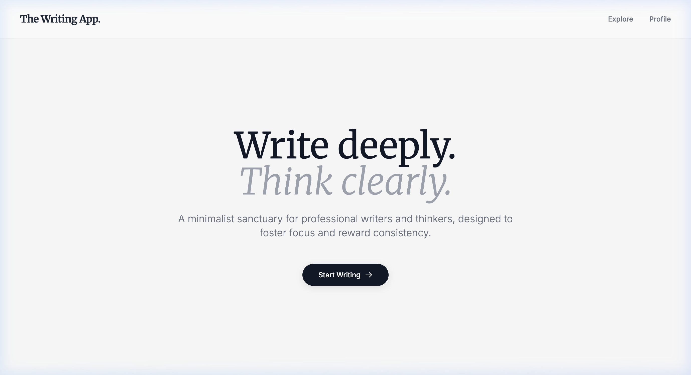
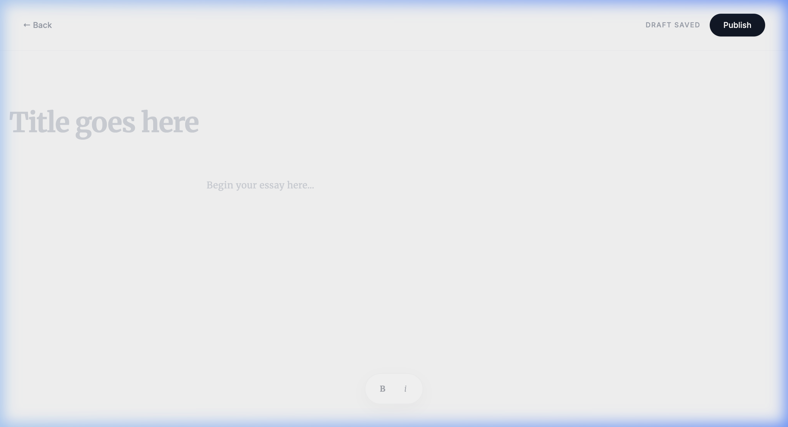
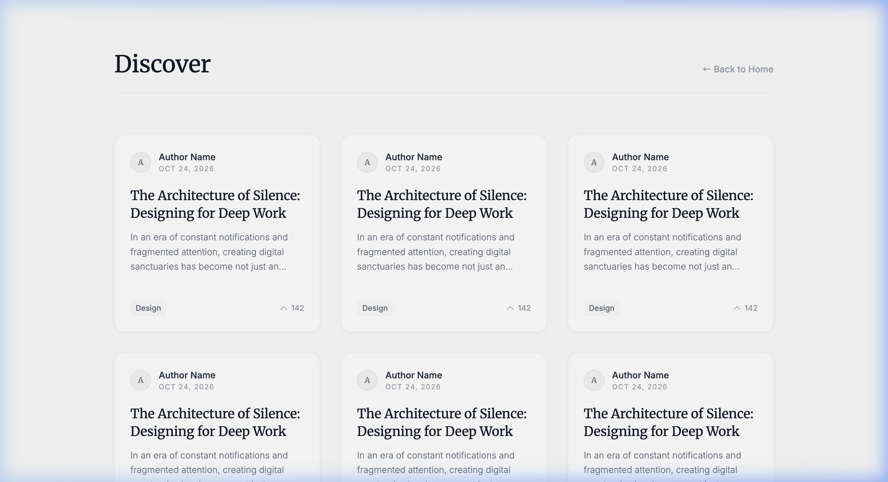

# The Writing App

A premium, minimalist, and distraction-free blogging platform built using the MERN stack (MongoDB, Express, React, Node.js). It's designed for writers and thinkers who value a clean and focused environment.

## 🌟 Key Features

*   **Distraction-Free Editor:** A custom-built rich text editor using Tiptap, emphasizing a clean canvas and unobtrusive formatting controls.
*   **Letterboxd-style Profiles:** A unique profile page that focuses on writer consistency, featuring a beautiful GitHub-like contribution graph and a "Selected Works" showcase.
*   **Discover Feed:** A streamlined feed for exploring new content, with typography-heavy, aesthetic cards.
*   **Minimalist UI/UX:** Built entirely with TailwindCSS, utilizing a focused color palette (off-whites and deep grays) and premium typography (`Inter` & serif stacks).

## 🏙️ Screenshots

### Home Page


### Editor


### Discover Page


## 🛠️ Technology Stack

*   **Frontend:** React 18, TypeScript, Vite, Tailwind CSS, React Router v6, Tiptap
*   **Backend:** Node.js, Express.js, MongoDB (Mongoose)
*   **Tooling:** Turborepo, ESLint, Prettier

## 🚀 Getting Started

### Prerequisites
*   Node.js (v18+)
*   npm or yarn or pnpm
*   MongoDB instance

### Installation

1. Clone the repository
```bash
git clone https://github.com/yourusername/TheWritingApp.git
```

2. Install dependencies (from the root)
```bash
npm install
```

3. Run the development server
```bash
npm run dev
```

## 📝 License
This project is licensed under the MIT License.
